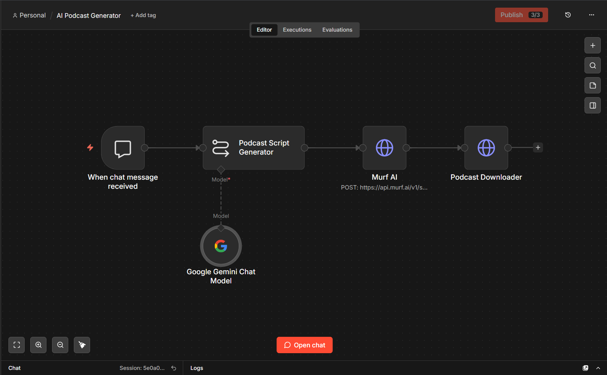

# 🎙️ AI Podcast Generator

An AI-powered podcast generation workflow built using n8n.

## 🚀 Overview

This project automatically generates podcast content from a user's chat input.

The workflow:

1. Receives a topic from the user
2. Generates a podcast script using Google Gemini
3. Converts the generated script into speech using Murf AI
4. Downloads the generated podcast audio

## 🛠️ Technologies Used

- n8n
- Google Gemini
- Murf AI
- REST API
- AI / NLP
- Webhooks

## 🔄 Workflow

1. **User Input**
2. **When Chat Message Received**
3. **Podcast Script Generator**
4. **Google Gemini Chat Model**
5. **Murf AI**
6. **Podcast Downloader**
7. **Generated Podcast Audio**

## ✨ Features

- AI-generated podcast scripts
- Natural-sounding AI voice generation
- Automated workflow
- Chat-based interaction
- End-to-end podcast generation
- API integration

## 📸 Workflow Screenshot

